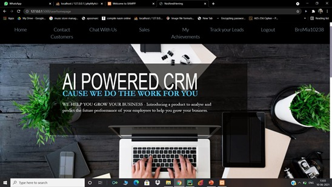

# 🤖 AI Powered CRM

An intelligent CRM solution that integrates AI technologies to optimize customer relationship management, sales tracking, communication, and overall enterprise resource planning (ERP) capabilities. This was a final-year engineering project developed as part of the Bachelor of Engineering curriculum at the International Institute of Information Technology, Pune.

---

## 📚 Table of Contents
- [Overview](#overview)
- [Motivation](#motivation)
- [Features](#features)
- [System Architecture](#system-architecture)
- [Modules](#modules)
- [Technology Stack](#technology-stack)
- [Algorithms](#algorithms)
- [Screenshots](#screenshots)
- [Results](#results)
- [Future Work](#future-work)
- [Contributors](#contributors)

---

## 📖 Overview

This CRM system leverages **Artificial Intelligence (AI)** to enhance productivity and customer engagement through features like intelligent lead scoring, customer communication, and performance tracking.

Traditional CRM systems lack adaptive intelligence. By integrating **Natural Language Processing**, **KNN**, and **Neural Networks**, this system dynamically learns user behavior and adapts to changing business requirements.

---

## 🚀 Motivation

- Traditional CRMs lack automation and real-time decision-making.
- AI improves prediction accuracy, automates responses, and enables smarter insights.
- Enhances team productivity and customer experience.

---

## ✨ Features

- 🤖 **AI Chatbot** – Real-time customer interaction
- 📈 **Sales Module** – Intelligent lead tracking and scoring
- 🕹️ **Gamification** – Employee performance engagement
- 💬 **Communication Module** – Streamlined internal & external communication
- 🧠 **Machine Learning** – Predictive analytics & customer behavior modeling

---

## 🧩 System Architecture

  
  

Includes:
- Frontend (User Interface)
- Backend Services (API Layer)
- Machine Learning Engine
- Database (Customer, Sales, Logs)

---

## 🧱 Modules

### 1. Chatbot Module
- Built using NLP techniques to handle customer queries.
  

  
  

### 2. Sales Module
- Tracks lead lifecycle, conversion status, and agent productivity.

  
  

### 3. Gamification Module
- Visual leaderboards and performance rewards.

  

### 4. Communication Module
- Integrates emails, messaging, and notifications.

  
  

---

### Other pages

  
  

---

## ⚙️ Technology Stack

| Component | Tech Used |
|----------|-----------|
| Frontend | HTML, CSS, JavaScript |
| Backend | Python (Flask) |
| Database | MySQL |
| AI Libraries | Scikit-learn, TensorFlow, Keras, NLTK |
| Dev Tools | VS Code, Git |

---

## 🧠 Algorithms

- **NLP (Natural Language Processing)** – for chatbot intent classification.
- **Feed Forward Neural Network (FNN)** – for customer sentiment prediction.
- **KNN (K-Nearest Neighbors)** – for lead categorization.

---

## 📊 Results

- Increased data consistency and process automation
- Improved customer satisfaction via intelligent query handling
- Enhanced team productivity with gamified dashboards

---

## 🔮 Future Work

- Integrate with voice-based assistants (e.g., Alexa)
- Expand data analytics to include predictive churn models
- Mobile app integration for on-the-go CRM management

---

## 👩‍💻 Contributors

- **Isha Narkhede**  
- Ishaan Pathak  
- Apoorva Ray Chaudhuri  
- Himanshu Nakkanwar  

> Supervised by Prof. Deptii Chaudhari

---

